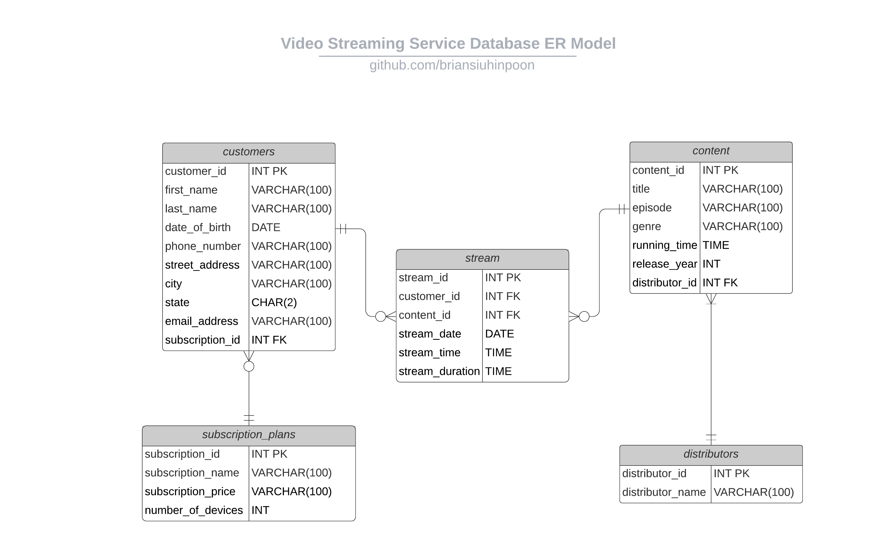

# Video Streaming Service Management System
A normalized relational database for a video streaming service provider.

## Inspiration
This RDBMS(Relational Database Management System) was inspired by managing a customer database for Netflix.

## How I designed it
Designed and structured a Entity-relationship model using Lucidchart.

## What I learned
I learned the basics of the programming language SQL and how to implement using MySQL. 
I also learned how to structure a relational database using database normalization to reduce data redundancy.
In addition, I learned how to generate query reports with an abstract analysis.

