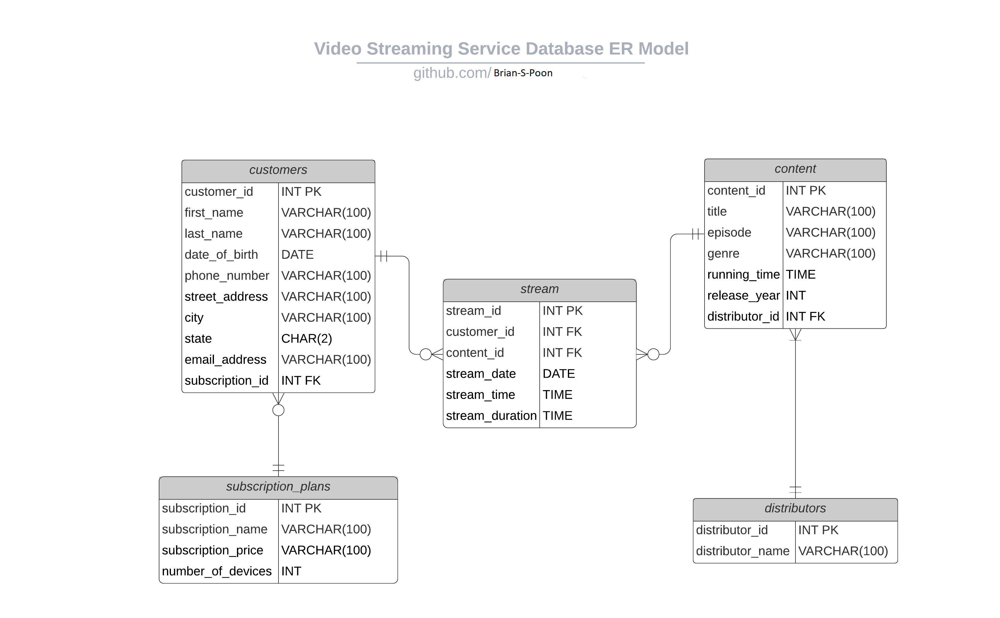

# Video Streaming Service Management System
A normalized relational database for a video streaming service provider.

## Inspiration
This RDBMS (Relational Database Management System) was inspired by an interest to build and manage a customer database for Netflix.

## How I designed it
I designed and structured a Entity-relationship model using Lucidchart.

<!--      -->

## How to setup database and test queries
Copy the sql code in create_database.sql and paste into MySQL or your desired RDBMS. Execute the query to create the database on your local computer.
Copy-paste and execute the queries in queries.sql to test corresponding results. There is also an option to import data records into your MySQL database by using the provided sample datasets in the sample-datasets folder.

## What I learned
I learned the basics of the programming language SQL and how to implement using MySQL. 
I also learned how to structure a relational database using database normalization to reduce data redundancy.
In addition, I learned how to generate query reports with an abstract analysis.

